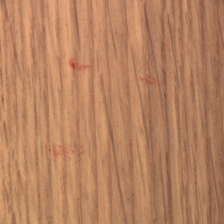
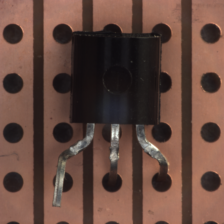
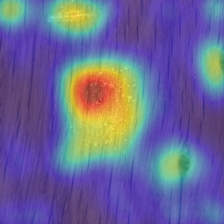
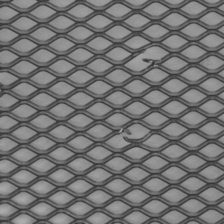
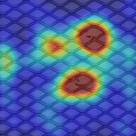
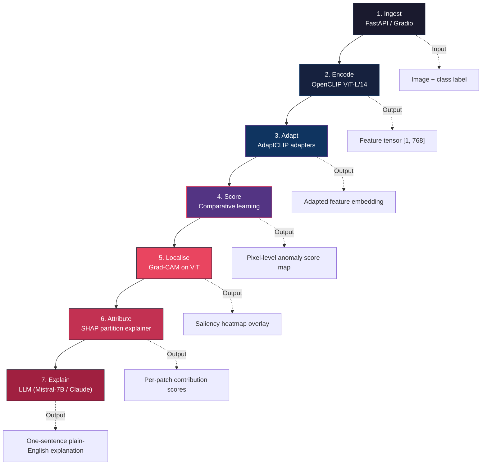
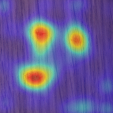
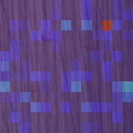
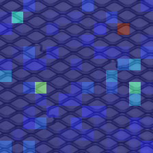
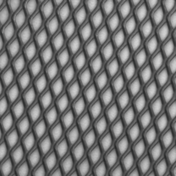

<p align="center">
  
  
  
</p>

<h1 align="center">AdaptCLIP Explainable Defect Inspector</h1>

<p align="center">
  <b>Zero/few-shot industrial anomaly detection with pixel-level heatmaps, SHAP attribution & natural-language explanations</b>
</p>

<p align="center">
  <a href="https://huggingface.co/spaces/AkifJK/xAI_Defect">
    
  </a>
  
  
  
  
</p>

---

## 🚀 Live Demo

**[→ Launch the interactive demo on Hugging Face Spaces](https://huggingface.co/spaces/AkifJK/xAI_Defect)**

Browse inspection results across **Wood**, **Grid**, and **Transistor** categories. Each sample shows:

| Original | Heatmap (Grad-CAM) | SHAP Attribution |
|---|---|---|
|  |  |  |
|  |  |  |
|  |  |  |

> The Space runs a lightweight Gradio app with precomputed artifacts — no GPU, no model downloads at startup.

---

## 🎯 What Makes This Different

| Conventional detectors | This system |
|---|---|
| Binary pass/fail score | **Pixel-level heatmap** showing *where* the defect is |
| Opaque black-box decision | **SHAP attribution** showing *which patches* drove the score |
| No explanation | **Natural-language sentence** describing defect type, location & cause (powered by LLM) |
| Requires hundreds of labelled defects | **Zero/few-shot** — works with 0–4 normal reference images |

> *"A quality inspector with no ML knowledge can look at the system output — heatmap overlay + one sentence — and immediately understand what is wrong and where."*

---

## 🏗 Pipeline

The system processes each image through **7 sequential stages**:



**AdaptCLIP** ([arXiv 2505.09926](https://arxiv.org/abs/2505.09926)) adds three lightweight adapters to a frozen CLIP backbone — none of the original CLIP weights are updated:

| Adapter | Role |
|---|---|
| **Visual adapter** | Maps patch features into anomaly-aware space via a 2-layer MLP |
| **Textual adapter** | Learns domain-optimal prompts describing normality / abnormality per category |
| **Prompt-query adapter** | Compares query embedding against normal reference memory bank |

Two complementary XAI methods run at inference:

- **Grad-CAM** — targets the final ViT-L/14 self-attention layer. Gradients of the anomaly score are used to weight spatial feature maps, producing a per-pixel saliency overlay ([captum](https://captum.ai/)).
- **SHAP** — treats the image as a grid of superpixels, measures marginal contribution of each patch by systematic masking and re-scoring ([shap](https://shap.readthedocs.io/)).

The top-5 SHAP patches + anomaly score + product class are formatted into a structured LLM prompt, producing sentences like:

> *"A surface scratch is visible on the lower-right quadrant of the metal nut, likely caused by abrasion during assembly."*

---

## 🧪 Example Results

### Wood — Color defect
| Input | Heatmap | SHAP |
|---|---|---|
|  |  |  |

### Grid — Bent wire
| Input | Heatmap | SHAP |
|---|---|---|
|  |  |  |

### Transistor — Bent lead
| Input | Heatmap | SHAP |
|---|---|---|
|  |  |  |

### Normal samples (no defect)
| Wood | Grid | Transistor |
|---|---|---|
|  |  |  |

---

## 📊 Evaluation

**Benchmark:** MVTec AD — 5,354 images, 15 categories (10 object + 5 texture), 60+ defect types.

| Metric | Target |
|---|---|
| Image-level AUROC (4-shot) | ≥ 85% |
| Pixel-level AUROC | Reported per category |
| AU-PRO (FPR threshold 0.3) | Standard MVTec segmentation metric |
| Inference latency (CPU) | ≤ 3s per 256x256 image |
| Grad-CAM defect overlap | ≥ 60% with ground-truth mask |
| SHAP top-5 patch overlap | ≥ 50% with defect mask |

---

## 🛠 Local Demo

```bash
pip install -r requirements.txt
python demo_app.py
```

---

## 📦 Export Real Artifacts

```bash
pip install -r requirements-colab.txt
python scripts/export_demo_bundle.py \
  --data_dir /path/to/mvtec_anomaly_detection \
  --output_dir /path/to/xAI_Defects \
  --categories bottle,cable,tile \
  --max_anomalous 2 \
  --max_normal 1
```

Writes `demo_manifest.json` + per-sample PNGs (`original.png`, `heatmap.png`, `shap.png`) to `demo_assets/`.

---

## 📚 Dataset

[MVTec AD on Kaggle](https://www.kaggle.com/datasets/ipythonx/mvtec-ad) — CC BY-NC-SA 4.0. The public repo contains only a small demo artifact bundle, not the full dataset.

---

## 🔬 References

1. **AdaptCLIP** — Gao et al. *Adapting CLIP for Universal Visual Anomaly Detection*. [arXiv 2505.09926](https://arxiv.org/abs/2505.09926) (May 2025)
2. **AnomalyCLIP** — Zhou et al. *Object-agnostic Prompt Learning for Zero-shot Anomaly Detection*. ICLR 2024
3. **Grad-CAM** — Selvaraju et al. *Visual Explanations from Deep Networks via Gradient-based Localization*. ICCV 2017
4. **SHAP** — Lundberg & Lee. *A Unified Approach to Interpreting Model Predictions*. NeurIPS 2017
5. **MVTec AD** — Bergmann et al. *A Comprehensive Real-World Dataset for Unsupervised Anomaly Detection*. CVPR 2019

